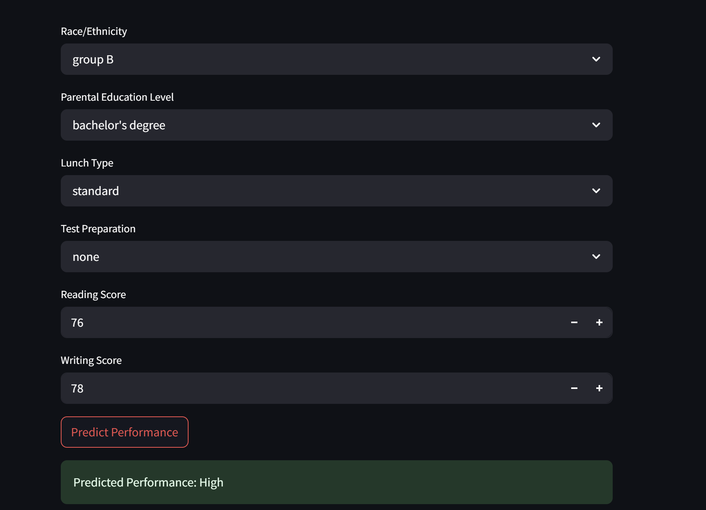

#  Student Performance Predictor

This project is a Machine Learning-based web application built using **Streamlit** that predicts student performance level (High, Medium, Low) based on input parameters like reading score, writing score, parental education, test preparation, lunch type, and more.

##  Demo



##  Features
- User inputs: 
  - Race/Ethnicity
  - Parental Education Level
  - Lunch Type
  - Test Preparation
  - Reading Score
  - Writing Score
- Output: Predicted performance level (Low, Medium, High)
- Real-time predictions using Streamlit web interface

## 🛠 Built With
- Python
- Scikit-learn
- Pandas
- Streamlit

##  Requirements

Install all the required packages using:

```bash
pip install -r requirements.txt
